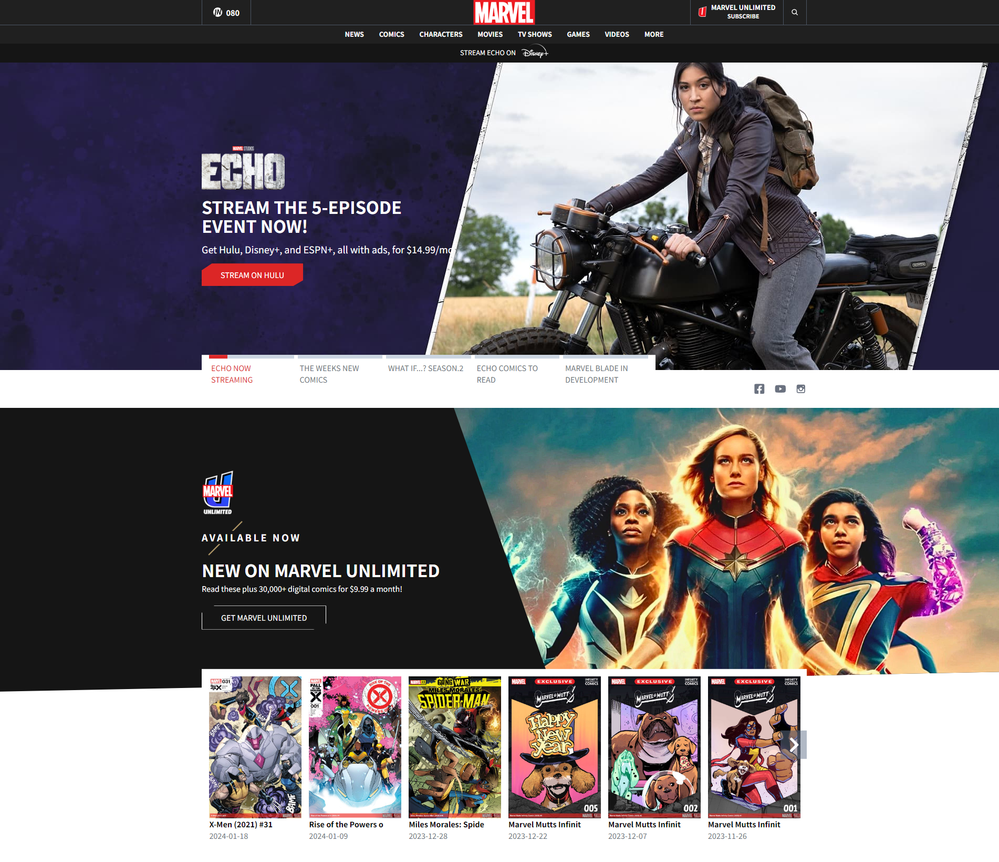
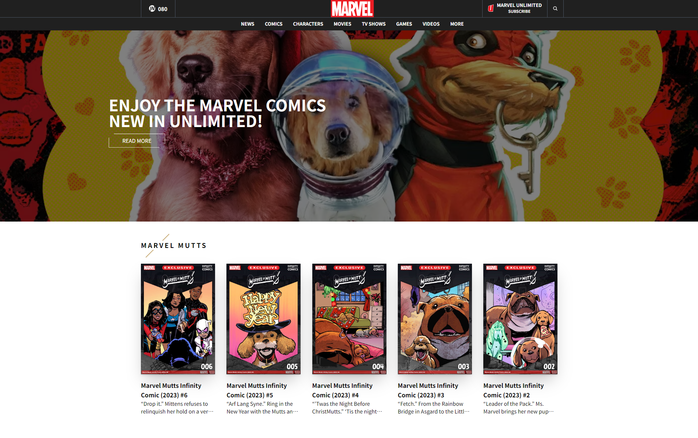
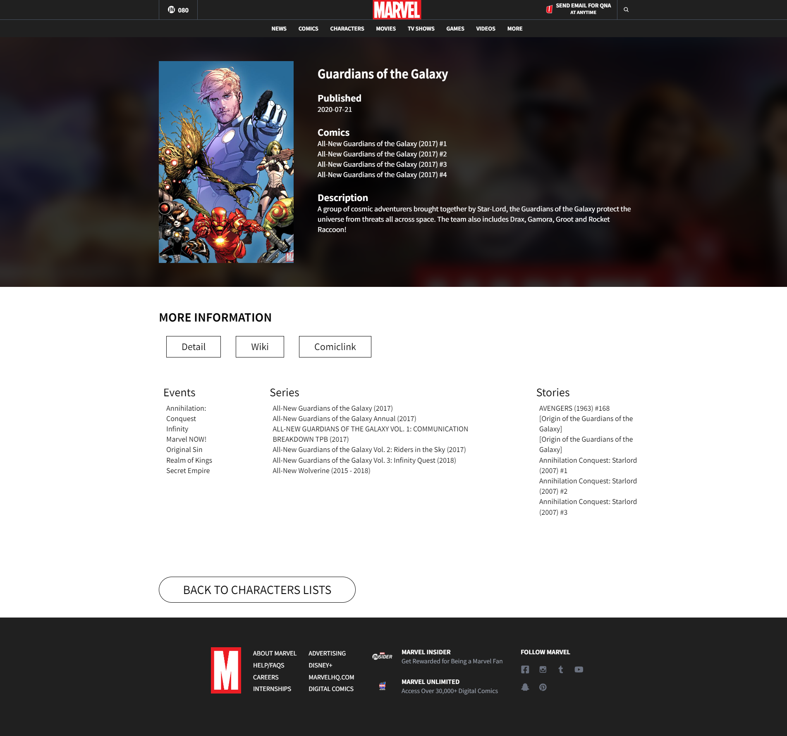

# Marvel Clone WEB

### 🔗링크
https://marble-web-two.vercel.app/

https://spontaneous-meringue-3846b5.netlify.app/

### 🔎소개
[Marvel 웹사이트](https://www.marvel.com/) 클론코딩입니다.
오픈 Api와 React Router, React-Query 등을 활용하여 만들었습니다.

### 📅제작 기간
2024.01.22 ~ 2024.02.08

### 🗂개발 환경
- React-Vite
- Tailwind

### 🎈주요 기능
- 모바일, 태블릿, PC 화면을 지원하는 반응형 디자인
- useQuery를 활용한 api 데이터 호출
- useInfiniteQuery를 활용한 무한 스크롤 UI
- React Router를 활용한 페이지 렌더링
- Framer motion을 활용한 동적 요소

### ✔ 미리보기

